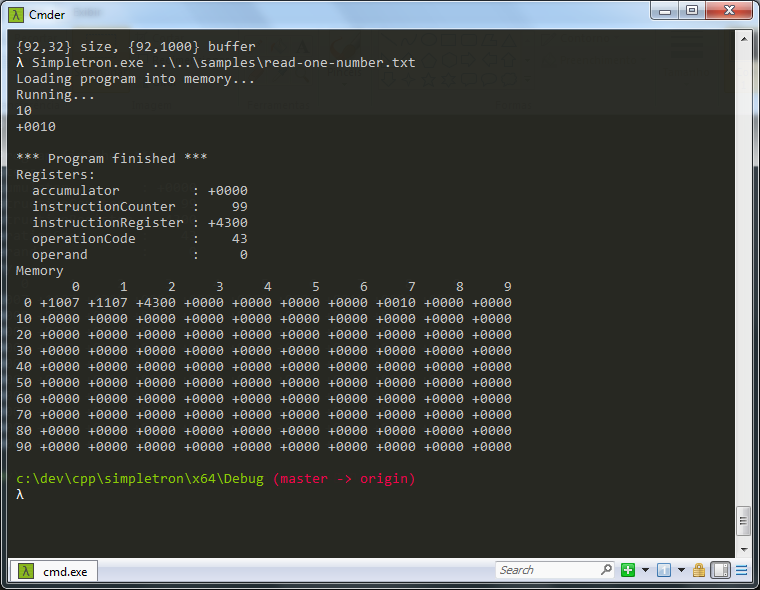

[](https://github.com/fabianosalles/simpletron/actions/workflows/cmake-tests.yml)

# Simpletron Machine Language Interpreter

A Simpletron Machine Language (SML) interpreter implementation in C++ as proposed by Deitel's book "C++ How to Program, 3rd edition".





## The Simpletron Machine Language 

The simpletron machine language contains a few instructions

| CODE | NAME       | DESCRIPTION                                | 
------ |------------|------------------------------------------- |
| 00   | noop       | consumes 1 CPU cycle but doesn't do anything 
| 10   | read       | read a word from stdin into a specific location in memory       
| 11   | write      | write a word from a specific location in memory to the terminal    
| 20   | load       | load a word from a specific location in memory into the accumulator 
| 21   | store      | store a word from the accumulator into a specific location in memory
| 30   | add        | add a word from a specific location in memory to the word in the accumulator (leaving the result in the accumulator)
| 31   | subtract   | subtract a word from a specific location in memory from the word in the accumulator (leave result in the accumulator)
| 32   | divide     | divide a word from a specific location in memory into the word in the accumulator (leaving result in accumulator)
| 33   | multiply   | multiply a word from a specific location in memory into the word in the accumulator (leaving result in accumulator)
| 40   | branch     | branch to a specific location in memory
| 41   | branchneg  | branch to a specific location in memory if the accumulator is negative
| 42   | branchzero | Branch to a specific location in memory if the accumulator is zero
| 43   | branchpos  | Branch to a specific location in memory if the accumulator is positive
| 50   | halt       | called when the program is done with its task

## Goals

This program was originally written as an academic exercise, so please be kind with my student's code style.
I've discovered this code in one old backup disk, and I decided to make some improvements:

 - [ ] Add runtime error checks
 - [ ] Add mnemonic support to the language
 - [ ] Implement a proper parser
 - [x] Add support to g++ and linux ( acheived via CMake )
 
 
## Building

Configure and compile the project using CMake. Make sure you have CMake installed on your system.

```bash
cmake -S . -B build
cmake --build build --config Release
```

## Running
Execute the interpreter binary with a sample file as an argument. The sample files are located in the `samples` directory.


### Linux / macOS
```bash
./build/bin/simpletron samples/add.txt
```

### Windows (PowerShell)

```PowerShell
.\build\bin\simpletron.exe samples\add.txt
```
## Running Tests
To execute the unit tests, first build the project with the `-DBUILD_TESTS=ON` option:
```bash
ctest --test-dir build --output-on-failure -C Release
```
Alternatively, run the tests binary directly:

### Linux / macOS:

```bash
./build/bin/simpletron_tests
```
### Windows (PowerShell):

```PowerShell
.\build\bin\simpletron_tests.exe
```
